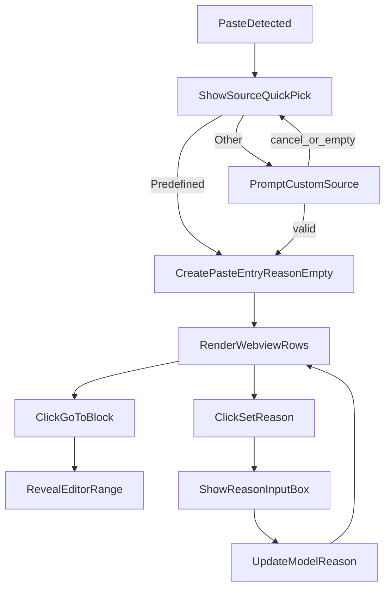

# v1.5 Implementation Plan

## Goal

Update SourceDoc to make paste attribution faster and less tedious:

- source chosen from options (`Stack Overflow`, `Github`, `ChatGPT`, `Claude Code`, `IDE Agent(Cursor, Github Copilot)`, `Other`)
- remove reason prompt during paste
- allow reason editing from webview per block
- clicking a webview block moves editor focus to that block

Reference patterns from VS Code samples:

- [vscode-extension-samples](https://github.com/microsoft/vscode-extension-samples)
- `quickinput-sample` for choice/input flows
- `webview-view-sample` for webview ↔ extension message passing

## Files to update

- [sourcePasteModel.ts](/Users/abhinavpillai/Coding Projects/sourcedoc-1/sourcedoc/src/sourcePasteModel.ts)
- [sourceWebviewViewProvider.ts](/Users/abhinavpillai/Coding Projects/sourcedoc-1/sourcedoc/src/sourceWebviewViewProvider.ts)
- [sourceMarkers.ts](/Users/abhinavpillai/Coding Projects/sourcedoc-1/sourcedoc/src/sourceMarkers.ts)
- [extension.ts](/Users/abhinavpillai/Coding Projects/sourcedoc-1/sourcedoc/src/extension.ts)

## Implementation steps

1. **Replace source input with choice-based flow in model**
  - In `SourcePasteModel`, replace the paste-time `showInputBox` source prompt with `showQuickPick` source options.
  - If `Other (Please Specify)` is chosen, open `showInputBox` and **re-prompt** if canceled/empty until valid custom source is entered or user selects another predefined source.
  - Keep serialized queue behavior so multiple pastes are processed one-at-a-time.
2. **Remove paste-time reason prompt**
  - Stop asking `Why was this code pasted?` during paste processing.
  - Store new entries with `reason: ''` initially.
3. **Add model APIs for webview-driven updates/navigation**
  - Add helper(s) to fetch/update a paste by index for a document URI (e.g., `updateReason(uri, index, reason)`), firing `onDidChange` after update.
  - Keep current decoration/webview refresh event path unchanged.
4. **Enable clickable webview rows + reason editing actions**
  - Extend webview row payload to include stable identity (`index`) and range info.
  - Add buttons/actions per row:
    - `Go to block` → post message to extension host with row index/range.
    - `Set reason` → post message; extension opens `showInputBox` (Quick Input style) and calls model update API.
  - Keep CSP-safe script behavior and existing rendering structure.
5. **Handle webview messages in provider and reveal code block**
  - In `SourceWebviewViewProvider.resolveWebviewView`, register `webview.onDidReceiveMessage`.
  - On `goToBlock`:
    - ensure document is opened in editor (`showTextDocument` if needed)
    - reveal and select target range (`editor.revealRange`, set `selection`) so user lands on the documented block.
  - On `setReason`:
    - open input box, persist reason via model, refresh webview/markers automatically through model event.
6. **Adjust hover semantics (optional wording only)**
  - Keep hover JSON showing `Source`, `Time`, `Reason`; optionally display `(none)` when reason empty.
7. **Validation**
  - Run lint/tests relevant to touched files.
  - Manual checks:
    - paste triggers source option menu
    - selecting predefined source records immediately
    - selecting `Other` enforces custom source entry with re-prompt behavior
    - no reason prompt at paste time
    - webview `Go to block` reveals correct lines
    - webview `Set reason` updates row and hover.

## Flow diagram

