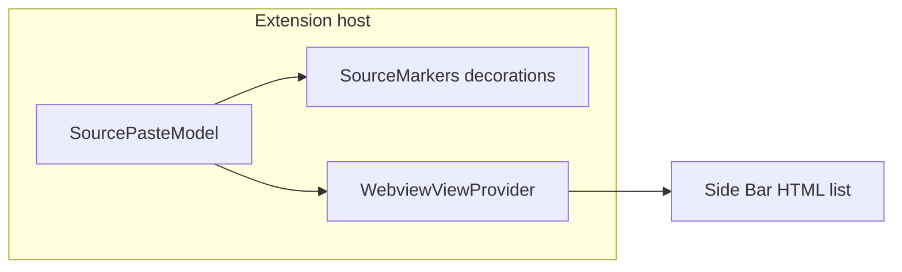

# Webview-based source visualization (V1 add-on)

## Goal

Provide a **second** way to see paste/source info: a **Webview View** in the Side Bar that stays **out of the way** (collapsible, dockable, never overlays the editor), while **keeping** the existing line decorations + hover behavior from `[sourceMarkers.ts](c:\Users\Proba\Documents\Coding Projects\sourcedoc\sourcedoc\src\sourceMarkers.ts)`.

Reference: [webview-view-sample](https://github.com/microsoft/vscode-extension-samples/tree/main/webview-view-sample) in [vscode-extension-samples](https://github.com/microsoft/vscode-extension-samples); general webview patterns in [webview-sample](https://github.com/microsoft/vscode-extension-samples/tree/main/webview-sample).

## UX choice (fixed)


| Option                            | Why not chosen                            |
| --------------------------------- | ----------------------------------------- |
| `createWebviewPanel` (editor tab) | Feels heavier; user asked for unobtrusive |
| Bottom Panel                      | Possible but less discoverable            |


**Chosen:** `window.registerWebviewViewProvider` with a view id under a **dedicated activity bar container** (e.g. "SourceDoc" icon) so the panel is one click away and can be collapsed entirely.




## Refactor: shared state

Today `[SourceMarkers](c:\Users\Proba\Documents\Coding Projects\sourcedoc\sourcedoc\src\sourceMarkers.ts)` owns `pastesByUri` internally. **Extract** a small `**SourcePasteModel`** (new file, e.g. `[sourcedoc/src/sourcePasteModel.ts](c:\Users\Proba\Documents\Coding Projects\sourcedoc\sourcedoc\src\sourcePasteModel.ts)`) that:

- Holds `Map<string, SourcedPaste[]>` (key = `document.uri.toString()`).
- Exposes `recordPasteFromChange(document, change)` or keeps paste detection in `SourceMarkers` / a thin coordinator—**minimal move**: either (a) move `looksLikePaste`, `insertedRangeForChange`, `toWholeLineRange`, and `handleDocumentChange` logic into the model, or (b) keep detection in `SourceMarkers` but delegate **append + notify** to the model.
- Exposes `**onDidChange`** (`vscode.EventEmitter<void>` + public `event`) so both UI layers refresh.
- Exposes `**getPastes(uri: vscode.Uri)`** (or string key) for the webview.

`SourceMarkers` then takes the model in its constructor, subscribes to `onDidChange`, and `**refreshEditor` reads pastes via `model.getPastes`** instead of `this.pastesByUri`. Paste recording moves to the model (single source of truth).

## New: Webview View provider

- New file e.g. `[sourcedoc/src/sourceWebviewViewProvider.ts](c:\Users\Proba\Documents\Coding Projects\sourcedoc\sourcedoc\src\sourceWebviewViewProvider.ts)` implementing `WebviewViewProvider`.
- `**resolveWebviewView`**: set `webview.options` (`enableScripts: true`, `localResourceRoots` limited to extension root if you add assets later).
- **HTML**: inline template string (keeps webpack simple—no extra copy step) with:
  - Minimal CSS for a compact list (file name, line range, time, source label, truncated prompt history).
  - `acquireVsCodeApi()` + `window.addEventListener('message', ...)` to replace list body on updates.
- **Updates**: On `model.onDidChange` and `window.onDidChangeActiveTextEditor`, call `postMessage` with serializable payload: active document URI string + array of `{ startLine, endLine, time, source, promptHistory }` (reuse `formatTime` / dummy strings from existing code—either export small helpers from `[sourceMarkers.ts](c:\Users\Proba\Documents\Coding Projects\sourcedoc\sourcedoc\src\sourceMarkers.ts)` or move constants + formatters to the model file).

**Empty state:** When no pastes for the active file, show a short hint ("Paste code to record sources" or similar).

## `package.json` contributions

In `[sourcedoc/package.json](c:\Users\Proba\Documents\Coding Projects\sourcedoc\sourcedoc\package.json)`:

- `**contributes.viewsContainers.activitybar`**: new container `sourcedoc` with `title` "SourceDoc" and `icon` pointing to a new asset, e.g. `[sourcedoc/media/icon.svg](c:\Users\Proba\Documents\Coding Projects\sourcedoc\sourcedoc\media\icon.svg)` (simple 24x24-style SVG; required for a non-broken activity bar entry).
- `**contributes.views.sourcedoc`**: one view with `"type": "webview"`, `"id": "sourcedoc.sourcePanel"` (or similar), `"name": "Current file"`.

Register in `[extension.ts](c:\Users\Proba\Documents\Coding Projects\sourcedoc\sourcedoc\src\extension.ts)`:

```ts
vscode.window.registerWebviewViewProvider('sourcedoc.sourcePanel', provider, { webviewOptions: { retainContextWhenHidden: true } })
```

(`retainContextWhenHidden` avoids flicker when switching views; optional but nice.)

## `.vscodeignore`

If you add `media/`, ensure `[sourcedoc/.vscodeignore](c:\Users\Proba\Documents\Coding Projects\sourcedoc\sourcedoc\.vscodeignore)` does **not** exclude `media/`** (verify after edit).

## Verification

- `npm run compile` and `npm run lint`.
- Run Extension Host: open Side Bar → SourceDoc → see list update when pasting; switch files and confirm list tracks **active editor** document.
- Confirm decorations + hover still work unchanged.

## Out of scope

- Clicking a list row to jump to line (nice follow-up).
- Settings toggle to disable decorations vs webview (could be v2).

